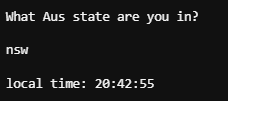

# HELP FILE
To run this program, you will need to have Python installed on your computer.
See this link to install the latest version of Python. https://www.python.org/downloads/  
1. Extract the directory Harry_Cashel_T1A3  
2. In terminal navigate to where you extracted the file.  
3. Run the command "chmod +x /src/main.py"  
4. Run the command "./src/main.py" or navigate to the directory /src and run the command “./main.py”.

Optional flags can be provided after these commands.
E.g. “./main.py –help”
--help – Will show you available flags
--navigation – Will show you navigation tips
--future – Will show you future updates

### Dependencies

In order to run this program we will need to make sure we have the following libraries

`import curses`
`import time`
`import calendar`  
`import pytz`  
`from datetime import datetime, timezone`
`from tzlocal import get_localzone`
`from os import system, name`
`import sys`
`import os`

#### Greeting
Enter any combination of characters to set your username.

#### Navigation
You can navigate the main menu with your arrow keys and select an application with Enter.

#### Exit
To exit the program, return to the main menu and select Close.

## Features
### Clock
Enter any Australian State to receive the local time. Accepted formats are abbreviated eg.. nsw or the full state name, “New South Wales”. It is not case-sensitive.

### Calendar
The Calendar will show you a month view of the current month. Press any key at any time to leave.

### Calculator
The calculator function supports basic arithmetic, addition, subtraction, multiplication and division in the format, a – b or b * a.

### Prompts
You will be provided with navigation prompts throughout the program. Follow the instructions. 😊

# T1A3 - Harry Cashel

## Software Development Plan

## Application Purpose and Scope

I will be creating a terminal application that will offer the user various tools
to assist them with daily tasks such as scheduling, computation, and time-management. 
A simple greeting will be displayed to the user and they will be provided with a 
menu of three useful tools. A calculator, a calendar, and a clock. 
This will be a barebones project, in the future, I hope to add features to round 
out the applications. These will include, calendar synchronisation, more extensive
math functions and a weather feature. 

### Who is this for?

This application is aimed at the anyone who needs to organise their life
and crunch numbers. It is also appropriate for a student. 

### Why is it useful?

Having a few handy tools at the ready in one location, this app is 
designed to complement a 9-5 schedule or a student.
It can be used to check the dates of the current month, 
saving the headache of missing a meeting or due date. 
The calculator is there on stand-by to help the user with any 
arithmetic and the clock feature to let them know to take breaks 
or get back to it!

### How can I use it?

Once the program is run a simple interface will prompt the user 
every step of the way. Asking for input when necessary to carry 
out a task or navigate the program.

## Features

### Pesonalised greeting on login

Once the user has entered their name, a greeting will be display alongside the menu.
Little to no error handling needed as it will be username based, 
if they want their name to be 1234, we will allow it.
This will be achieved with a simple user input, string interpolation and print, 
followed by the main program function.

### Ability to navigate menu

After the user is greeted. A menu will be displayed with the features available 
on this app. I want the user to be able to navigate this menu with their arrow 
keys and highlight the current option. I want to have all features defined as 
their own functions and call them where necessary in a main run function. I 
use a for loop (with some simple arithmetic) to hold the relative centre x 
and y coordinates in variables and conditional statements to print the menu.

A while loop will be used to run the state of the menu and identify the 
selection the user makes. I will use conditional statements along with 
the build in curses function getch and a local variable to store the user 
input and allow the navigation of the menu. Nested conditionals will be 
used to run the selected features.

### Calendar 

The calculator will be a simple feature, providing the user with the ability
to use all basic arithmetic operators. A local variable will be used to 
store user input and I will use try/except to handle unsupported user input. 
I will use a function with conditional statements to give the user the 
option to calculate again or return to the main menu.

### Clock

This feature will provide the local time given an Australian capital city. 
Local variables will be used to store the time of capitals and a dictionary 
to store the city, formatted string pairs. A local variable will store user 
input and a conditional chain will be used to print the selected matching data. 
An else statement to handle incorrect user input.

## User Interaction 

The menu navigation of the program is very straightforward, each screen has 
prompts for input. On execution the user is prompted to enter their name and 
greeted. The user is then presented with a menu and navigation explained above.

Once the user has selected a feature, instructions will be presented the user if necessary.

The user only has the option to return to the main menu, and any key will
take them back.

The user is guided through the calculator feature, requesting an input to 
either reset the feature or return to the main menu.

## Control Flow Diagram 

## Implementation Plan

To finish this project on time I will have to make a hierarchical implementation plan with core concepts being completed first. I have come up with the idea and a timeline of when to have features finished by.

### Issues I forsee for each feature

#### Calendar feature
i. Define function  
ii.	Will need to print to terminal inside curses function  
iii. Read datetime documentation   
iv.	Implement user input to return to main menu  

#### Main Menu navigation
i. Centre the menu in terminal  
ii.	Highlight user choice while unaffecting rest of menu  
iii. Enable features to run from this menu  
iv.	Close program from this menu  

#### Calculator feature
i.	Take user input  
ii.	Error handling for incorrect inputs  
iii. Printing answer to screen  
iv.	Running program again… user selection  
v.	Returning to main menu  

#### Clock feature
i.	Will need to break out of curses window  
ii.	Take user input   
iii. Error handling for incorrect input  
iv.	Print the correct data correlating with user input  
v. Run program again or return to main menu  

### Solutions to issues

#### Calendar feature
i. Store day/month/year in local variables  
ii.	Use datetime, ptyz, calendar libraries  
iii. Use the addscr function!!  

#### Menu 
i. Store menu in a list
ii. Conditional loop with enumerate to print to centre and highlight selected feature  
iii. Conditional chain the enable menu navigation and running selected feature  
iv. String interpolation to print selection to user  

#### Calculator feature
i. Use the built in eval function  
ii. Try and except for error handling of incorrect input  

#### Clock feature
i. Store timezones in variables  
ii. Store timezonen/formatted string key value pairs in dictionary  
iii. Conditional chain to print correct data  
iv. String interpolation to print formatted time!  

After some research I decided on the modules/libraries I will need to use and the general flow of the coding. A simple menu, navigation and separate features being defined as functions and called as needed by the main run function.

To make the main menu I will need to create a list, store the centre of the terminal in variables to show the menu in centre. Doing some research, I found the best way to display the menu will be using the curses library and a for loop to print each row and highlight the selected option. A while loop will be used to navigate and run the selected feature. 

